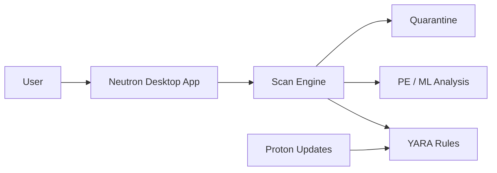

# Neutron

### Experimental, local-first security software for Windows

[Features](#-features) ·
[Risk notice](#-important-security-notice) ·
[Support](#-no-support-or-security-commitment) ·
[License](#-license) ·
[Türkçe](README.tr.md) ·
[Issues](https://github.com/omerbugrae/Neutron/issues)

 

> [!WARNING]
> **Neutron is experimental software — use at your own risk.**
>
> It is not a replacement for Microsoft Defender, endpoint protection, regular backups, or professional security advice.

## ⚡ Features

| Feature | Description |
| :--- | :--- |
| 🔎 **File scanning** | Quick, full, and selected-folder scans |
| 🧬 **YARA detection** | Rule- and signature-based threat analysis |
| 🧠 **Static analysis** | PE static analysis and EMBER-based ML scoring |
| 🛡️ **Real-time protection** | Optional file, memory, network, and ransomware monitoring |
| 📦 **Quarantine** | Quarantine and restoration workflow for suspicious files |
| 🪟 **AMSI integration** | Additional inspection for supported Windows script hosts |
| 🔄 **Proton updates** | Signed threat-intelligence/rule updates with rollback support |
| 📅 **Scheduled scanning** | Automatic quick-scan support, from the service even with no user signed in |
| 🧷 **Driver & service monitoring** | Reports newly registered or repointed kernel drivers and Windows services (BYOVD visibility) |
| ⏱️ **Scheduled task monitoring** | Reports new or repointed Task Scheduler entries running unsigned commands |
| 🩺 **Self-protection** | Continuously verifies the AMSI registration, the service, the rule store and the quarantine payloads |
| 🧬 **WMI persistence monitoring** | Reports WMI event subscriptions being created or changed |
| 🌳 **Process-start monitoring** | Push-based, with the ancestry chain — catches processes too short-lived to poll for |
| 🔑 **Credential-access monitoring** | Reports processes holding read access to LSASS memory |
| 📜 **Event log monitoring** | Cleared audit logs, audit-policy changes, new local admins, service installs, Defender being switched off |
| 🧱 **Windows posture monitoring** | Defender, firewall, UAC, RDP, Secure Boot and driver-signing state |
| 🛑 **Automatic response** | Disables tasks and services, deletes WMI subscriptions, removes trust-store certificates, reverts weakened Windows settings and terminates suspicious processes — logged, rate-limited and reversible |
| 🔏 **Trust store monitoring** | Reports certificates added to the machine root and publisher stores |
| 🧹 **Removal helper** | Standalone forced-removal script shipped with the app, plus an uninstall wizard reachable from Control Panel |

## 🧩 How it works

## ✅ Requirements

- Windows 10 (64-bit, version 1809+) or Windows 11 — x64 (AMD64) only, no ARM64/x86 build
- AMD64-architecture processor, 2 GHz or faster
- 4 GB RAM minimum, 8 GB recommended
- At least 1 GB free disk space for the installed application, plus ~250 MB more if you download the optional Machine Learning Feature Update
- Administrator privileges may be required for some system-level protection features
- A trusted, up-to-date Windows installation
- Current backups of important data

## ⚠️ Important security notice

Neutron may inspect files, monitor system activity, register optional Windows security components, create firewall rules, and quarantine suspicious files. These actions can affect the normal operation of applications and the operating system.

Before using Neutron:

- Back up important data.
- Test it first in a virtual machine or non-production environment.
- Review detections before quarantining, deleting, or permanently removing files.
- Expect both false positives and false negatives.
- Do not disable Microsoft Defender or another trusted security product unless you fully understand the consequences.
- Use only releases and updates you trust.
- Never publish API keys, license keys, signing keys, private certificates, or sensitive paths.

## 🧯 Risks and limitations

<b>Click to view risks and limitations</b>

 

- Detection is based on signatures and heuristic analysis; malware can be missed.
- Legitimate files may be flagged, blocked, or quarantined.
- Real-time monitoring can affect performance, battery usage, and application compatibility.
- Administrator-level features may alter Windows settings, services, registry entries, AMSI registration, and firewall rules.
- Updates, rules, and machine-learning models can introduce regressions or unexpected detections.
- This project has not been independently security audited.
- The software is provided **as is**, without warranties of any kind.

## 🚫 No support or security commitment

Neutron is provided as an experimental and community project.

- No technical, installation, customer, or usage support is provided.
- No maintenance, update, patch, or compatibility guarantee is provided.
- No SLA, response-time promise, security monitoring service, or emergency incident response is offered.
- Security reports may be reviewed voluntarily, but no response, fix, disclosure, or update timeline is guaranteed.
- No detection rate, threat-prevention effectiveness, data-integrity, or system-compatibility guarantee is made.
- Do not rely on Neutron as your only security control or for critical systems and sensitive data.
- The user is solely responsible for backups, testing, reviewing detections, and using additional security measures.

To the maximum extent permitted by applicable law, the authors and contributors are not liable for data loss, false detections, missed threats, security incidents, downtime, incompatibility, or damages arising from the use or inability to use this software.

## 🤝 Responsible use

Use Neutron only on systems and files that you own or are explicitly authorized to manage. Do not use it to bypass security controls, interfere with others, or violate applicable law or policy.

## 📄 License

Neutron is source-available under the [PolyForm Noncommercial License 1.0.0](LICENSE.md).

Commercial use is not permitted. Any commercial use, resale, commercial distribution, paid service, or use as part of a commercial product requires prior written permission from the copyright holder.

This is not an OSI-approved open-source license.

**Neutron — local security, transparent code.**

[⬆ Back to top](#neutron)

