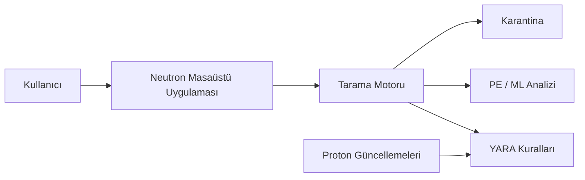

# Neutron

### Windows için deneysel, yerel odaklı güvenlik uygulaması

[Özellikler](#-özellikler) ·
[Riskler](#-önemli-güvenlik-uyarısı) ·
[Destek](#-destek-ve-güvenlik-taahhüdü-yoktur) ·
[Lisans](#-lisans) ·
[English](README.md) ·
[Issues](https://github.com/omerbugrae/Neutron/issues)

 

> [!WARNING]
> **Neutron deneysel bir güvenlik yazılımıdır. Kendi sorumluluğunuzda kullanın.**
>
> Microsoft Defender’ın, kurumsal uç nokta korumasının, düzenli yedeklemenin veya profesyonel güvenlik desteğinin yerine geçmez.

## ⚡ Özellikler

| Özellik | Açıklama |
| :--- | :--- |
| 🔎 **Dosya tarama** | Hızlı tarama, tam tarama ve seçilen klasörü tarama |
| 🧬 **YARA tespiti** | Kural ve imza tabanlı tehdit analizi |
| 🧠 **Statik analiz** | PE dosyaları için statik analiz ve EMBER tabanlı ML puanlaması |
| 🛡️ **Gerçek zamanlı koruma** | İsteğe bağlı dosya, bellek, ağ ve fidye yazılımı izleme |
| 📦 **Karantina** | Şüpheli dosyalar için karantina ve geri yükleme akışı |
| 🪟 **AMSI entegrasyonu** | Desteklenen Windows betik ortamları için ek inceleme |
| 🔄 **Proton güncellemeleri** | İmzalı tehdit istihbaratı/rule güncellemeleri ve geri alma desteği |
| 📅 **Zamanlanmış tarama** | Otomatik hızlı tarama; servis modunda kimse oturum açmamışken de çalışır |
| 🧷 **Sürücü ve servis izleme** | Yeni kaydedilen ya da hedefi değiştirilen çekirdek sürücülerini ve Windows servislerini bildirir (BYOVD görünürlüğü) |
| ⏱️ **Zamanlanmış görev izleme** | Görev Zamanlayıcı'ya eklenen ya da hedefi değiştirilen, imzasız komut çalıştıran görevleri bildirir |
| 🩺 **Kendini koruma** | AMSI kaydını, servisi, kural deposunu ve karantinadaki dosyaları sürekli doğrular |
| 🧬 **WMI kalıcılık izleme** | Oluşturulan ya da değiştirilen WMI olay aboneliklerini bildirir |
| 🌳 **Süreç başlatma izleme** | Anlık ve soyağacıyla — poll edilemeyecek kadar kısa yaşayan süreçleri de yakalar |
| 🔑 **Kimlik bilgisi erişimi izleme** | LSASS belleğine okuma erişimi açık tutan süreçleri bildirir |
| 📜 **Olay günlüğü izleme** | Temizlenen denetim günlükleri, denetim politikası değişiklikleri, yeni yerel yöneticiler, servis kurulumları, Defender'ın kapatılması |
| 🧱 **Windows güvenlik duruşu izleme** | Defender, güvenlik duvarı, UAC, RDP, Güvenli Önyükleme ve sürücü imzalama durumu |
| 🛑 **Otomatik müdahale** | Görevleri ve servisleri devre dışı bırakır, WMI aboneliklerini siler, güven deposundan sertifika kaldırır, zayıflatılan Windows ayarlarını geri alır, şüpheli süreçleri sonlandırır — kayıtlı, hız sınırlı ve geri alınabilir |
| 🔏 **Güven deposu izleme** | Makine kök ve yayımcı depolarına eklenen sertifikaları bildirir |
| 🧹 **Kaldırma yardımcısı** | Uygulamayla birlikte gelen bağımsız zorlamalı kaldırma betiği ve Denetim Masası'ndan erişilebilen kaldırma sihirbazı |

## 🧩 Nasıl çalışır?

## ✅ Gereksinimler

- Windows 10 (64-bit, 1809 sürümü veya üzeri) ya da Windows 11 — yalnızca x64 (AMD64), ARM64/x86 derlemesi yok
- AMD64 mimarili işlemci, 2 GHz veya üzeri
- En az 4 GB RAM, 8 GB önerilir
- Kurulum için en az 1 GB boş disk alanı, isteğe bağlı Makine Öğrenmesi Feature Update indirilirse ~250 MB daha
- Bazı sistem seviyesi koruma özellikleri için yönetici yetkisi
- Güvenilir ve güncel bir Windows kurulumu
- Önemli veriler için güncel yedek

## ⚠️ Önemli güvenlik uyarısı

Neutron; dosyaları inceleyebilir, sistem etkinliğini izleyebilir, isteğe bağlı Windows güvenlik bileşenlerini kaydedebilir, güvenlik duvarı kuralları oluşturabilir ve şüpheli dosyaları karantinaya alabilir. Bu işlemler normal uygulamaların ve işletim sisteminin çalışmasını etkileyebilir.

Kullanmadan önce:

- Önemli verilerinizi yedekleyin.
- Önce sanal makinede veya üretim dışı bir cihazda deneyin.
- Karantinaya alma, silme veya kalıcı kaldırma işleminden önce tespitleri inceleyin.
- Yanlış pozitif ve yanlış negatif sonuçların oluşabileceğini kabul edin.
- Sonuçlarını tam anlamadığınız sürece Microsoft Defender’ı veya güvenilir başka bir korumayı devre dışı bırakmayın.
- Yalnızca güvendiğiniz sürümleri ve güncellemeleri kullanın.
- API anahtarlarını, lisans anahtarlarını, imzalama anahtarlarını ve özel sertifikaları herkese açık depolara yüklemeyin.

## 🧯 Riskler ve sınırlamalar

<b>Riskleri ve sınırlamaları görmek için tıklayın</b>

 

- Tespitler imza ve sezgisel analizlere dayanır; bazı zararlı yazılımlar tespit edilemeyebilir.
- Zararsız dosyalar şüpheli olarak işaretlenebilir, engellenebilir veya karantinaya alınabilir.
- Gerçek zamanlı izleme performansı, pil kullanımını ve uygulama uyumluluğunu etkileyebilir.
- Yönetici yetkisi isteyen özellikler Windows ayarlarını, servisleri, kayıt defterini, AMSI kaydını ve güvenlik duvarı kurallarını değiştirebilir.
- Güncellemeler, kurallar ve makine öğrenmesi modelleri beklenmeyen tespitlere ya da gerilemelere neden olabilir.
- Bu proje bağımsız bir güvenlik denetiminden geçmemiştir.
- Yazılım **olduğu gibi** ve herhangi bir garanti olmadan sunulur.

## 🚫 Destek ve güvenlik taahhüdü yoktur

Neutron deneysel ve topluluk odaklı bir proje olarak sunulmaktadır.

- Teknik destek, kurulum desteği, müşteri desteği veya kullanım desteği sunulmaz.
- Bakım, güncelleme, yama veya uyumluluk garantisi verilmez.
- SLA, yanıt süresi sözü, güvenlik izleme hizmeti veya acil olay müdahalesi sunulmaz.
- Güvenlik bildirimleri gönüllü olarak incelenebilir; ancak yanıt, düzeltme, açıklama veya güncelleme takvimi garanti edilmez.
- Tehdit tespit oranı, koruma başarısı, veri bütünlüğü veya sistem uyumluluğu için garanti verilmez.
- Neutron; kritik sistemlerde, hassas verilerde veya tek güvenlik katmanı olarak kullanılmamalıdır.
- Yedek alma, test etme, tespitleri inceleme ve ek güvenlik önlemleri kullanma sorumluluğu tamamen kullanıcıya aittir.

Uygulanabilir hukukun izin verdiği azami ölçüde; yazarlar ve katkıda bulunanlar veri kaybı, yanlış tespit, kaçırılan tehdit, güvenlik olayı, kesinti, uyumsuzluk veya yazılımın kullanımından ya da kullanılamamasından doğabilecek zararlardan sorumlu tutulamaz.

## 🤝 Sorumlu kullanım

Neutron’u yalnızca sahibi olduğunuz veya açık yetkinizin bulunduğu sistemlerde kullanın. Güvenlik önlemlerini aşmak, diğer kullanıcıları etkilemek veya yasa/politika ihlali amacıyla kullanmayın.

## 📄 Lisans

Neutron, [PolyForm Noncommercial License 1.0.0](LICENSE.md) ile kaynak kodu erişilebilir olarak sunulmaktadır.

Ticari kullanım yasaktır. Ticari kullanım, yeniden satış, ticari dağıtım, ücretli hizmet içinde kullanım veya ticari bir ürünün parçası olarak kullanım için telif hakkı sahibinden önceden yazılı izin alınmalıdır.

Bu lisans, OSI onaylı bir açık kaynak lisansı değildir.

**Neutron — yerel güvenlik, şeffaf kod.**

[⬆ Başa dön](#neutron)

